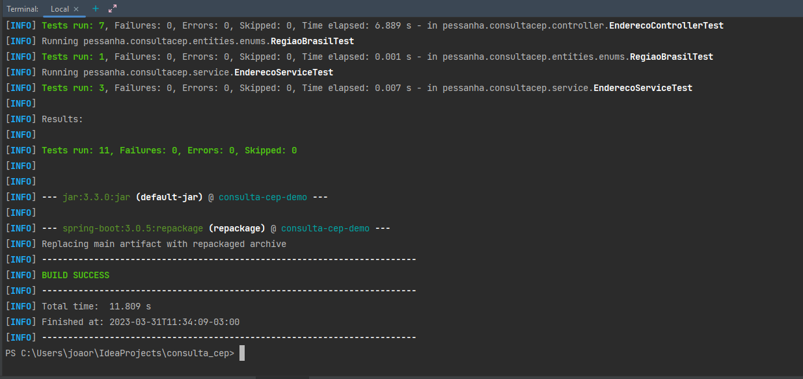
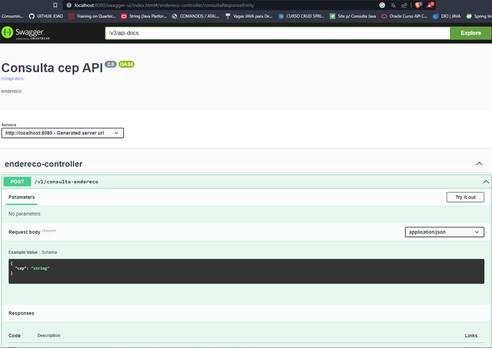

# consulta_cep
API para consulta de CEP

## Conceito
A idéia é construir uma API REST de consulta de endereço e cálculo de frete para um determinado CEP, e a consulta do endereço deverá ser feita a API VIA CEP, conforme documentação https://viacep.com.br/.

## Stack
- Java 11+  
- Spring boot 3  
- API REST Template   
- Documentação Swagger   
- Docker file

## Por que essa stack?
Utilizei essa Stack apenas para demonstrar o meu conhecimento em spring, Rest Template e docker.

## Cobertura de testes
100% coberto por testes de integrações, utilizando:  
-  Teste unitário Junit5  
-  Teste Integrado Mock mvc  


## SWAGGER
http://localhost:8080/swagger-ui/index.html


## Exemplos para testar
```
curl -X 'POST' \
'http://localhost:8080/v1/consulta-endereco' \
-H 'accept: */*' \
-H 'Content-Type: application/json' \
-d '{
"cep": "01524999"
}' 
```

### 200 OK
Request
```
{  
    "cep":"01524000"  
}
```

Response
```
{  
    "cep": "01524-000",  
    "rua": "Rua da Independência",  
    "complemento": "lado par",  
    "bairro": "Cambuci",  
    "cidade": "São Paulo",  
    "estado": "SP",  
    "frete": 7.85  
}
```

### 404 NOT FOUND
Request
```
{  
    "cep":"01524999"  
}
```
Response
```
{
    "message": "CEP NÃO ENCONTRADO"
}
```

## DOCKER
```
mvn clean
mvn package
docker build -t consulta-cep .
docker run -p 8080:8080 -d consulta-cep
docker ps
```


